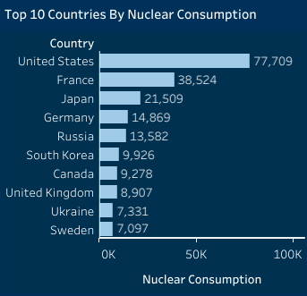
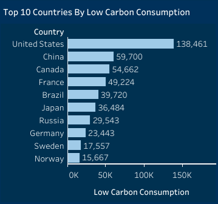
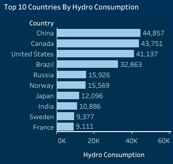
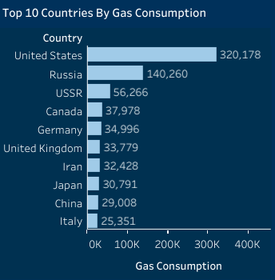

# World Energy Consumption Analysis

## Project Overview
### Introduction:
The "World Energy Consumption Analysis" project aims to provide a comprehensive analysis of global energy consumption patterns using the dataset provided by Our World in Data. This dataset, regularly updated, offers key metrics on energy consumption, energy mix, electricity mix, and other relevant factors, making it an invaluable resource for understanding the current state and trends in global energy use.

## Objectives:
The primary objectives of the World Energy Consumption Analysis project are:
- Identify the top 10 countries by total energy consumption.
- Determine the top 10 countries by electricity generation.
- Identify the top 10 countries by GDP and population.
- Identify the top 10 countries by energy consumption per GDP.
- Identify the top 10 countries by energy consumption per capita.
- Evaluate trends in energy consumption by year.
- Assess trends in carbon intensity by year.
- Identify the top 10 countries by renewable energy consumption.
- Identify the top 10 countries by solar energy consumption.
- Identify the top 10 countries by wind energy consumption.
- Identify the top 10 countries by biofuel consumption.
- Identify the top 10 countries by gas consumption.
- Identify the top 10 countries by fossil fuel consumption.
- Identify the top 10 countries by coal consumption.

  ### Expectations:
- Gain insights into the global distribution of energy consumption.
- Understand the leading countries in electricity generation.
- Correlate energy consumption with economic and population data.
- Evaluate energy efficiency by comparing energy consumption per GDP.
- Analyze energy consumption patterns on a per capita basis.
- Observe historical trends in global energy consumption.
- Track changes in the carbon intensity of electricity generation.
- Identify leaders in renewable energy adoption.
- Understand the contributions of solar energy by top countries.
- Analyze wind energy consumption among leading countries.
- Evaluate the use of biofuels in top-consuming countries.
- Assess gas consumption patterns across top countries.
- Examine the global distribution of fossil fuel consumption.
- Identify major coal-consuming countries.
- Understand the role of nuclear energy in top countries.
- Highlight countries leading in low-carbon energy adoption.
- Assess the importance of hydro energy among top countries.
 

### About The Dataset
This dataset is a collection of key metrics maintained by [Our World in Data](https://ourworldindata.org/energy). It is updated regularly and includes 
data on energy consumption (primary energy, per capita, and growth rates), energy mix, electricity mix, and 
other relevant metrics. The dataset is made up of a table with 130 fields. The Energy consumption (primary energy, energy mix and energy intensity) fields data is sourced from a combination of two sources—the [BP Statistical Review of World Energy](https://www.bp.com/en/global/corporate/energy-economics.html) and [SHIFT Data Portal](https://www.theshiftdataportal.org/energy). The Electricity consumption (electricity consumption, and electricity mix) fields are sourced from a combination of two sources: the [BP Statistical Review of World Energy](https://www.bp.com/en/global/corporate/energy-economics.html) and [EMBER – Global Electricity](https://ember.shinyapps.io/GlobalElectricityDashboard/).

The other variables are collected from a variety of sources (United Nations, World Bank, 
Gapminder, Maddison Project Database, etc.). More information on the fields in ths data is available in [our codebook](https://github.com/owid/energy-data/blob/master/owid-energy-codebook.csv). The dataset for this analysis can be accessd [here](World%20Energy%20Consumption.csv). The variables in this data represent all of our main data related to energy consumption, energy mix, electricity mix as well as other variables of potential interest.

All visualizations, data, and code produced by Our World in Data are completely open access under the [Creative Commons BY license](https://creativecommons.org/licenses/by/4.0/). You have the permission to use, distribute, and reproduce these in any medium, provided the source and authors are credited.
 
 

### Skills Utilized
1. Data Cleaning
2. Data Modelling
3. Data Visualiziation
4. Descriptive Analytics
5. Critical Thinking and Problem Solving
6. Communication and Reporting
 

### Tools Used
1. MS SQL Server
    - Was used to:
        1. Extract,
        2. Clean,
        3. Transform,
        4. Load all the datasets for this analysis.

2. Tableau (Was used to create dashboards for this analysis)
    - The following Tableau were incorporated:
        1. Calculated Fields
        2. Geospatial Analysis
        3. Page Navigation
        4. Filters
        5. Tooltips
        6. Buttons
 

### Data Cleaning, Transformation and Loading using MS SQL Server:
A little data cleaning was done here because the data was almost clean as at when it was accessed from the source, i just had little work to do here before importing the data source into Tableau. I did the below:
1. Changed the data type of thise fields that are of the wrong data type to the right data type.
2. Made sure that all the data types of the 130 fields in this dataset were of the right data type.
 

**MS SQL Server View**

Sql Query Screenshot                                                               |                                
:---------------------------------------------------------------------------------:|
    

You can preview the MYSQL query file [here](World_Energy_Consumption_Analysis_Project.sql)
 
 

## Visualization in Tableau:
#### Report View 1

#### Report View 2

 
 

### Project Analysis:
From the analysis, i made the following Key findings below:
- Carbon Iintensity (Total): __231,714__
- Energy Consumption (Total): __16,946,543__
- Energy Efficiency (Total): __12,684__
- Fossil Fuel Consumption (Total): __11,727,842__
- Hydro Consumption (Total): __840,003__
- Nuclear Consumption (Total): __687,171__
- Renewable Energy Consumption (Total): __1,026,638__
- Renewable Energy Share (%): __7__
 
 

- 

- **Top 10 Countries With the Most Electricity Generation:**
- In this analysis of the top 10 countries by electricity generation, it shows that the United States and China lead with 134,268 TWh and 100,948 TWh, respectively. Japan and Russia follow, each generating around 34,000 TWh. India’s generates 23,869 TWh, while Germany’s generates 21,046 TWh. Canada 20,764 TWh, and France 18,488 TWh, Brazil 13,920 TWh, and the UK generates 12,528 TWh. This data stresses the strength and dominance of major economies and a shift towards sustainable energy.

- This analysis also reveals that the United States and China dominate due to their vast industrial bases. Japan and Russia follow closely, driven by advanced technology and abundant natural resources. India’s growing energy demand reflects its rapid economic expansion, while Germany’s focus on renewables highlights its commitment to sustainable energy. Canada leverages hydropower, France relies on nuclear energy, Brazil excels in hydropower, and the UK is transitioning to a diverse energy mix of of natural gas, nuclear, and renewables. This data highlights the energy production leadership of major economies and a global shift towards renewable and low-carbon energy sources.
 
 

- 

- **Top 10 Countries With the Most Energy Consumption:**
- The top 10 countries by energy consumption vary significantly in their energy usage due to economic activities and industrial bases. The United States leads with 1,248,243 GWh, China follows with 742,645 GWh, Russia consumes 359,606 GWh, Japan utilizes 266,010 GWh. Germany consumes 213,441 GWh, India’s 102,072 GWh, Canada 164,126 GWh, France 138,695 GWh, the UK 135,854 GWh, and Brazil raps up the top 10 with an energy consumption of 97,897 GWh.

- The United States and China dominate global energy consumption, reflecting their economic leadership. Industrialized nations like Russia, Japan, and Germany also show high consumption due to advanced industrial activities. Emerging economies, particularly India, are experiencing rapid energy demand growth. France and Brazil shows significant reliance on nuclear and hydropower, respectively, indicating strong sustainable energy practices. The UK’s energy consumption reveals a shift towards a diverse and sustainable energy mix, reducing fossil fuel dependence. These insights underscore global variations in energy consumption patterns, driven by economic activities, energy policies, and development levels.
 
 

- 

- **Top 10 Countries With the Most Renewable Energy Consumption:**
- This analysis shows that the United States leads with 60,752 GWh, followed by China with 53,736 GWh of renewable energy consumption. Canada consumes 45,384 GWh and Brazil 38,914 GWh. Russia utilizes 15,961 GWh, while Norway consumes 15,667 GWh. Japan consumes 14,974 GWh, India 13,137 GWh, and France 10,700 GWh. Sweden made it to the top 10 with a renewable energy consumption of 10,460 GWh.

- The leading renewable energy consumers, the United States and China, shows their global leadership in transitioning to sustainable energy. Canada's and Brazil’s high consumption is driven by their extensive use of hydropower. Russia and Norway's renewable consumption highlights their investment in hydropower, while Japan and India reflect increasing renewable adoption amid industrial expansion. France’s inclusion despite its significant reliance on nuclear energy, also invests in renewables, and Sweden noted for its strong emphasis on sustainable energy sources, also showcases their committment to renewable energy. These insights illustrate global trends towards renewable energy adoption, driven by both resource availability and policy initiatives aimed at reducing carbon footprints.
 
 

- 

- **Energy Consumption Trend by Year:**
- The "Energy Consumption Trend by Year" line chart lays emphases on primary energy consumption from 2000 to 2019. This chart shows a consistent increase in primary energy consumption. Starting at 338,362 GWh in 2000, there is a steady rise, reaching 486,583 GWh in 2019. Notable increments are observed in the early 2000s, with a significant jump from 361,956 GWh in 2003 to 379,661 GWh in 2004. Despite a slight dip in 2009, likely due to the global financial crisis, the overall trend remains upward. Post-2010, the growth continues, with consumption crossing the 450,000 GWh mark in 2012 and reaching nearly 470,000 GWh by 2015.

- The upward trend in primary energy consumption signifies the increasing global demand driven by population growth, industrialization, and economic development. The dip in 2009 highlights the impact of global economic fluctuations on energy use. The steady rise post-2010 indicates strength and recovery in global energy demand, possibly fueled by advancements in technology and increased energy access. This trend emphasizes the need for sustainable energy policies to manage growing consumption and mitigate environmental impacts.
 
 

- 

- **Carbon Intensity Trend by Year:**
- The "Carbon Intensity Trend by Year" from 2000 to 2020 analysis indicates a significant decrease in carbon intensity over the two decades. Starting at 12,795 in 2000, the carbon intensity initially fluctuates around the 13,000 mark until 2004, before beginning a more pronounced decline. By 2009, it drops to 11,438, continuing to fall steadily each year. Notable reductions occur after 2012, with carbon intensity decreasing from 11,281 to 10,112 by 2014. The downward trend accelerates post-2015, with a marked decline from 9,945 in 2015 to 7,118 in 2020.

- The steady decline in carbon intensity reflects global efforts to reduce carbon emissions through improved energy efficiency, a shift towards cleaner energy sources, and stricter environmental regulations. The significant drop post-2012 signifies the impact of international climate agreements and the adoption of renewable energy technologies. This trend underscores the positive progress made in decarbonizing energy production, yet it also indicates the need for continued efforts to sustain and accelerate the reduction in carbon intensity to combat climate change effectively.
 
 

- 

- **Top 10 Countries With the Most Nuclear Consumption:**
- The analysis shows that the United States leads significantly with 77,709 GWh, more than double that of France, which is second with 38,524 GWh. Japan follows with 21,509 GWh, Germany consumes 14,869 GWh and Russia utilizes 13,582 GWh. South Korea follows with (9,926 GWh and Canada next with 9,278 GWh. The United Kingdom consumes 8,907 GWh, Ukraine 7,331 GWh, and Sweden round out the top ten with 7,097 GWh, each with substantial contributions to their energy mix.

- The dominance of the United States in nuclear consumption signifies its extensive nuclear infrastructure and reliance on nuclear power for electricity. France’s substantial nuclear consumption mirrors its strategy of using nuclear energy to reduce carbon emissions. Japan's significant consumption, despite reductions, indicates ongoing reliance on nuclear energy. Germany’s position, despite plans to phase out nuclear power, highlights its current energy mix. The presence of South Korea, Canada, the UK, Ukraine, and Sweden reflect their advanced nuclear programs and emphasizes the importance of nuclear energy in diversifying energy sources and reducing carbon footprints. These insights reveal a global dependence on nuclear power for stable, low-carbon energy amidst varying national energy policies.
 
 

- 

- **Top 10 Countries With the Most Low Carbon Consumption:**
- United States is at the forefront of the top 10 countries with the most low carbon consumption with 138,461 GWh, China follows with 59,700 GWh, Canada (54,662 GWh) and France (49,224 GWh), respectively. Brazil comes next with a low carbon consumption rate of 39,720 GWh, while Japan consumes 36,484 GWh. Russia is next with 29,543 GWh and Germany with 23,443 GWh. Sweden with 17,557 GWh and Norway with 15,667 GWh completes the list.

- The United States top position in low-carbon consumption reflecting its substantial investment in low-carbon energy. China's position shows its strategic expansion in renewable energy to meet rising energy demands sustainably. Canada and Brazil's dependence on hydropower and France’s focus on nuclear energy significantly reduce their carbon footprints. Japan's continues investing in low-carbon technologies despite nuclear challenges, along with Russia and Germany's transition efforts and strategies, reflect global efforts to shift towards cleaner energy. Sweden and Norway set benchmarks with their robust commitments to renewable energy, showcasing effective models for sustainable energy consumption.
 
 

- 

- **Top 10 Countries With the Most Hydro Consumption:**
- China sits at the top of this chart with 44,857 GWh hydro consumption rate. Canada follows closely with 43,751 GWh, while the United States ranks third with 41,137 GWh. Brazil consumes 32,863 GWh. Russia 15,926 GWh, and Norway 15,569 GWh. Japan follows with 12,096 GWh and India is next with 10,886 GWh. Sweden with 9,377 GWh and France with 9,111 GWh completes the list with the most hydro consuming countries.

- China's leadership in hydro consumption reveals its massive infrastructure projects aimed at harnessing renewable energy. Canada's high ranking reflects its utilization of abundant natural water resources for energy production. The United States' position illustrates its balanced approach to diverse energy sources, including hydropower. heavy reliance on hydropower, contributes a substantial portion to its energy consumption. Russia, Norway, Japan, and India's significant hydro consumption reflect their ongoing investments in hydro energy, and also indicate their efforts to diversify energy sources and reduce carbon emissions. Sweden and France's inclusion in the top ten highlights their ongoing investments and commitments to renewable energy.
 
 

- 

- **Top 10 Countries With the Most Gas Consumption:**
- China
