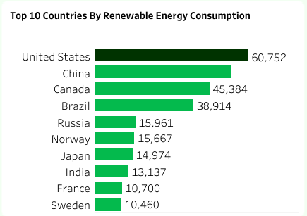
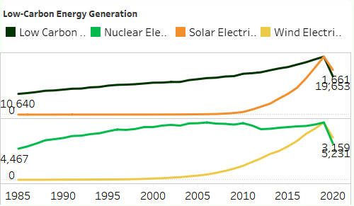
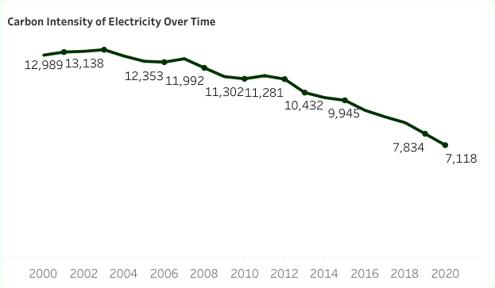

# World Energy Consumption Analysis

 

## Table of Contents
- [Project Overview](#project-overview)
- [About The Dataset](#about-the-dataset)
- [Tools Used](#tools-used)
- [Visualization in Tableau](#visualization-in-tableau)
- [Project Analysis](#project-analysis)
- [Tableau Dashboard Visualization](#tableau-dashboard-visualization)  
- [Recommendations on Strategies for Improving Energy Efficiency, Increasing Renewable Energy Adoption, and Reducing Carbon Emissions](#recommendations-on-strategies-for-improving-energy-efficiency-increasing-renewable-energy-adoption-and-reducing-carbon-emissions)
 

## Project Overview
### Introduction:
The "World Energy Consumption Analysis" project aims to provide a comprehensive analysis of global energy consumption patterns using the dataset provided by Our World in Data. This dataset, regularly updated, offers key metrics on energy consumption, energy mix, electricity mix, and other relevant factors, making it an invaluable resource for understanding the current state and trends in global energy use.

## Objectives:
The goal of the World Energy Consumption Analysis project are:
- Identify the top 10 countries by total energy consumption.
- Determine the top 10 countries by electricity generation.
- Identify the top 10 countries by energy consumption per GDP.
- Identify the top 10 countries by energy consumption per capita.
- Evaluate trends in energy consumption by year.
- Assess trends in carbon intensity by year.
- Identify the top 10 countries by Nuclear consumption.
- Identify the top 10 countries by Low Carbon consumption.
- Identify the top 10 countries by Hydro consumption.
- Identify the top 10 countries by renewable energy consumption.
- Identify the top 10 countries by gas consumption.

  ### Expectations:
- Learn the global distribution of energy consumption.
- Know the top countries in electricity generation.
- Compare the energy efficiency by looking at the energy consumption against GDP.
- Observe energy consumption patterns by capita.
- Take a view of the historical trends of world energy consumption.
- Follow changes in carbon intensity of electricity generation
- Know the top leaders in using renewable energy.
- Look at gas consumption trends in the top countries.
- Understand the position of nuclear energy in top countries.
- Identify top countries on the basis of low-carbon energy adoption.
- Assess the standing of hydro energy among top countries.
 

### About The Dataset
This dataset is a collection of key metrics maintained by [Our World in Data](https://ourworldindata.org/energy). It is updated regularly and includes 
data on energy consumption (primary energy, per capita, and growth rates), energy mix, electricity mix, and 
other relevant metrics. The dataset is made up of a table with 130 fields. The Energy consumption (primary energy, energy mix and energy intensity) fields data is sourced from a combination of two sources — the [BP Statistical Review of World Energy](https://www.bp.com/en/global/corporate/energy-economics.html) and [SHIFT Data Portal](https://www.theshiftdataportal.org/energy). The Electricity consumption (electricity consumption, and electricity mix) fields are sourced from a combination of two sources: the [BP Statistical Review of World Energy](https://www.bp.com/en/global/corporate/energy-economics.html) and [EMBER – Global Electricity](https://ember.shinyapps.io/GlobalElectricityDashboard/).

The other variables are collected from a variety of sources (United Nations, World Bank, Gapminder, Maddison Project Database, etc.). More information on the fields in ths data is available in [our codebook](https://github.com/owid/energy-data/blob/master/owid-energy-codebook.csv). The dataset for this analysis can be accessd [here](World%20Energy%20Consumption.csv). The variables in this data represent all of our main data related to energy consumption, energy mix, electricity mix as well as other variables of potential interest.

All the data is provided by Our World in Data are completely open access under the [Creative Commons BY license](https://creativecommons.org/licenses/by/4.0/). There are permissions for the usage of this data.
 
 

### Skills Utilized
1. Data Cleaning
2. Data Modelling
3. Data Visualiziation
4. Descriptive Analytics
5. Critical Thinking and Problem Solving
6. Communication and Reporting
 

### Tools Used
1. MS SQL Server
    - Was used to:
        1. Clean,
        2. Transform the datasets for this analysis.

2. Tableau (Was used to create dashboards for this analysis)
    - The following Tableau tools were incorporated:
        1. Calculated Fields
        2. Page Navigation
        3. Filters
        4. Tooltips
        5. Buttons
 

### Data Cleaning, Transformation and Loading using MS SQL Server:
Some data cleaning was done here, the data came clean to a great extent from the source, I just had some cleaning to do here after which I imported the data into Tableau. I did the below:
1. Changed the data types of the fields that were of the wrong data types.
2. Made sure that all the data types of the 130 fields in this dataset were of the right data type.
 

**SQL View**

Sql Query Screenshot                                                               |                                
:---------------------------------------------------------------------------------:|
    

You can preview the SQL query file [here](World_Energy_Consumption_Analysis_Project.sql)
 
 

## Visualization in Tableau:
#### Overview

#### Trends

#### Insights

 
 

### Project Analysis:
From the analysis, i made the following Key findings below:
- Carbon Intensity (Total): __231,714__
- Energy Consumption (Total): __16,946,543__
- Energy Efficiency (Total): __12,684__
- Fossil Fuel Consumption (Total): __11,727,842__
- Hydro Consumption (Total): __840,003__
- Nuclear Consumption (Total): __687,171__
- Renewable Energy Consumption (Total): __1,026,638__
- Renewable Energy Share (%): __7__
 
 

- 

- **Top 10 Countries With Most Electricity Generation:**
- This top 10 countries' ranking analysis in electricity generation indicates that the United States and China are at the apex with 134,268 TWh and 100,948 TWh, respectively. Japan and Russia follow each, with a generation of approximately 34,000 TWh. India's is 23,869 TWh, while that of Germany rests at 21,046 TWh. Canada's is 20,764 TWh, while that of France is 18,488 TWh, Brazil at 13,920 TWh, and the UK is 12,528 TWh. The data thus reflects mostly countries with big economies, with a strong move to renewable energy.

- The top two are the United States and China due to the huge industrial base, followed by Japan and Russia. Both these countries are richly endowed with high technologies and rich natural resources. The demand from India, to meet fast-growing energy needs, and Germany's quest for renewable energy, reflects each country's priority for sustainable energy. Canada in hydropower, France in nuclear power, the UK recently did an energy shift toward a diverse mix with natural gas, nuclear, and renewable energy, and Brazil performs at the top in hydropower. These data point toward a diverse list of role models in terms of energy production among the major economies, underlining the trend toward renewable and low-carbon sources of energy.
 
 

- 

- **Top 10 Countries With Most Energy Consumption:**
- The top 10 countries by energy consumption are vastly different in their energy usage due to their economic activities and industrial bases. The US leads with 1,248,243 GWh, China is second with 742,645 GWh, Russia with 359,606 GWh, and Japan with 266,010 GWh. Germany with 213,441 GWh, India with 102,072 GWh, Canada with 164,126 GWh, France with 138,695 GWh, the UK with 135,854 GWh, and Brazil with 97,897 GWh.

- The US and China are the biggest energy consumers because they are the economic leaders. Industrialized countries like Russia, Japan, and Germany have high consumption because of their advanced industrial activities. Emerging economies like India are seeing rapid energy demand growth. France and Brazil have strong nuclear and hydropower respectively, so they have good sustainable energy practices. The UK’s energy consumption shows a move towards a diverse and sustainable energy mix and reducing fossil fuel dependence. This highlights the global variation in energy consumption patterns driven by economic activities, energy policies, and development levels.
 
 

- 

- **Top 10 Countries With Most Renewable Energy Consumption:**
- This analysis shows that the United States leads with 60,752 GWh, China with 53,736 GWh, Canada 45,384 GWh, Brazil 38,914 GWh. Russia 15,961 GWh, Norway 15,667 GWh, Japan 14,974 GWh, India 13,137 GWh, France 10,700 GWh. Sweden makes it to the top 10 with 10,460 GWh.

- The top 2 renewable energy consumers US and China are leading the way to a sustainable future. Canada and Brazil are high consumers because of their large hydropower capacity. Russia and Norway are investing in hydropower, Japan and India are increasing their renewable adoption with industrial growth. France is in the list despite being a big nuclear player, they also invest in renewables and Sweden is known for its strong focus on sustainable energy sources, they also commit to renewable energy. These numbers show the trend towards renewable energy adoption driven by both resource availability and policy to reduce carbon footprint.
 
 

- 

- **Energy Mix Distribution:**
- Dominance of Energy Sources Globally
- Oil remains the dominant energy source globally, with Kuwait relying on oil for 99% of its energy, while China consumes over 56% of its energy from coal. Renewables make up less than 10% of the energy mix in most countries, except for leaders like Iceland, where renewables contribute 89%.

- Renewable Energy Leaders
- Iceland generates 89% of its energy from renewables, mainly geothermal and hydropower. Brazil follows closely with 43%, primarily from hydropower, while Austria obtains 33% of its energy from renewables, showing the potential of natural resources in driving green transitions.

- Regions with Significant Nuclear Energy Use
- France leads in nuclear energy, which accounts for 41% of its energy consumption, while Belgium and Bulgaria follow with 38% and 34%, respectively. In contrast, Africa and Australia have negligible nuclear use, with contributions below 1%.

- Fossil Fuel Dependence
- China relies on coal for 56% of its energy, India for 44%, and South Africa for 69%, reflecting high carbon emissions. Their renewable energy contributions are below 10%, signaling significant opportunities for clean energy investments.

- Balanced Energy Mix
- France demonstrates a diversified energy mix with 41% from nuclear, 32% from oil, and 16% from renewables, serving as a model for balancing sustainability and energy security.

- Countries with Minimal Renewable Energy
- Kuwait (1%), Israel (3%), and Kazakhstan (5%) are highly dependent on fossil fuels, with renewables contributing minimally, indicating challenges in transitioning to clean energy.

- Top Oil Consumers
- Iraq derives 91% of its energy from oil, Ecuador 78%, and Hong Kong 72%, highlighting their heavy reliance on oil for energy production and transportation.

- Regions with Potential for Renewable Growth
- Africa and Asia rely on fossil fuels like oil and coal for over 80% of their energy, but with abundant sunlight and wind resources, their renewable contributions, currently under 10%, can grow significantly with investments.

- Dependence on Gas as a Transitional Fuel
- Algeria relies on natural gas for 57% of its energy, Azerbaijan 62%, and Bangladesh 65%, demonstrating the importance of gas in their energy strategies while they gradually explore renewables.

- Emerging Renewable Energy Markets
- Chile generates 21% of its energy from renewables, with a focus on solar and wind, while Argentina is at 17%, reflecting growing efforts to reduce fossil fuel reliance in South America.

- Energy Diversity in Europe
- Countries like Germany balance energy sources with 33% from oil, 25% from renewables, and 12% from nuclear, showcasing Europe's focus on energy security and sustainability.
 
 

- 

- **Fossil Fuels vs Renewables (Comparison):**
- Renewables Growth Over Time:
- Renewable energy consumption shows a consistent growth trend from 7,159.03 in 1966 to 43,785.91 in 2019, with significant acceleration after 2000, reflecting increased global focus on sustainable energy sources.
  
- Fossil Fuels Volatility:
- Fossil fuel consumption trends display significant volatility, with periods of decline, such as in 1974 (-1,878.09) and 2009 (-7,136.96), likely driven by economic recessions, energy crises, or shifts toward alternative energy.

- Over Point:
- From the data, renewables surpass fossil fuels in overall trend growth around the 2010s, highlighting the global transition toward cleaner energy solutions.

- Sharp Renewables Growth in the 21st Century:
- etween 2000 and 2019, renewable energy consumption increased by over 23,000 units, nearly doubling, due to technological advancements, policy incentives, and global climate commitments.

- Economic and Policy Impacts on Fossil Fuels:
- Fluctuations in fossil fuel trends, especially declines in 1980, 1990, and 2009, align with historical economic crises or increased global awareness of environmental concerns.
 
 

- 

- **Year-Over-Year Changes In Energy Consumption:**
- __Trend Analysis__
- From 1966 to 2019, energy consumption change trends show periods of steady growth, significant spikes, and occasional declines.
- Example Insight: The largest positive change occurred in 2010 (+19,958.84 TWh), while the largest decline was in 2009 (-5,916.07 TWh).

- __Growth vs. Decline Periods__
- Insight: Identify years with negative consumption changes and their potential causes (e.g., economic crises or policy changes).
- Highlight periods of strong growth (e.g., 2004–2007) and periods of stagnation or slow growth (e.g., early 1980s).

- __Growth vs. Decline Periods__
   - __Growth Years:__
      - Strong growth was observed in 1984 (+12,417.24 TWh), 2004 (+17,704.74 TWh), and 2010 (+19,958.84 TWh).
      - The late 2000s (2003–2007) saw consistent growth, with increases of +12,325.03 TWh (2003) and +13,193.44 TWh (2005).
   - __Decline Years:__
      - 1980 (-1,652.68 TWh), 2009 (-5,916.07 TWh), and minor declines in the early 1980s (1981: -812.47 TWh, 1982: -627.16 TWh) were periods of negative change.

- __Significant Peaks and Dips__
   - __Peaks:__
      - The highest yearly increase was in 2010 (+19,958.84 TWh), likely reflecting recovery from the 2008 financial crisis and industrial energy demands.
      - Other peaks include 2004 (+17,704.74 TWh) and 1984 (+12,417.24 TWh).

- __Rate of Change__
   - Average yearly change over the dataset: ~6,342 TWh/year.
   - Decade Comparison:
      - 1980s: Mixed, with small growth and declines (e.g., 1980–1983 averaging +312 TWh/year).
      - 2000s: Rapid growth, averaging ~8,000 TWh/year, with significant spikes in 2004 (+17,704.74 TWh) and 2010 (+19,958.84 TWh).

- __Impact of Global Events__
   - 1970s Energy Crisis: After steady growth (e.g., 1973: +10,792.72 TWh), consumption dropped in 1974 (+1,065.79 TWh) due to oil shocks.
   - 1980s Oil Crash: Declines in 1980 (-1,652.68 TWh) and 1982 (-627.16 TWh) coincide with economic recessions.
   - 2008 Global Recession: Significant decline in 2009 (-5,916.07 TWh) followed by a sharp recovery in 2010 (+19,958.84 TWh).

- __Future Projections___
   - Using the general upward trend, energy consumption is projected to continue growing unless interrupted by economic or environmental challenges. The sharp growth observed post-2000s suggests increased energy 
     needs driven by industrialization and technological advancements.

 
 

- 

- **Energy Consumption Trend by Year:**
- The "Energy Consumption by Year" line chart shows primary energy consumption from 2000 to 2019. This chart goes up. Starting at 338,362 GWh in 2000, it goes up. Big jumps in the early 2000s, 361,956 GWh in 2003 to 379,661 GWh in 2004. A small dip in 2009 probably due to the global financial crisis but overall it goes up. After 2010 it goes up some more, crossing 450,000 GWh in 2012 and almost 470,000 GWh in 2015.

- The up trend means global demand driven by population growth, industrialization and economic development. The dip in 2009 means global economic fluctuations affect energy use. The up trend after 2010 means strength and recovery in global energy demand probably driven by technology and increased energy access. This trend means we need to have sustainable energy policies to manage growing consumption and mitigate environmental impacts.
 
 

- 

- **Total Energy Consumption Over Time By Source:**
- __Coal Consumption:__
- Showed a general upward trend from 1965 to 2019, with peak consumption in 2007. Consumption started declining post-2014, indicating a shift toward cleaner energy.

- __Nuclear Energy:__
- Consistent increase until the late 1980s, followed by stagnation and decline post-2010. This decline is due to safety concerns and competition from renewable energy sources.

- __Oil Consumption:__
- Consistently increased from 1965 to 2019, peaking in 2019. Recent stabilization suggests shifts toward alternatives like electric vehicles.

- __Renewables:__
- Grew rapidly, particularly after 2000, surpassing 45,000 units in 2019. This increase is driven by technological advances, policy changes, and global climate goals.

- __Shifting Energy Mix:__
- Renewables are gaining market share, while coal and nuclear are declining. Oil remains dominant but is stabilizing.

- __Drivers of Change:__
- Policy changes, technological innovation, and climate awareness are key drivers of the energy transition towards renewables.

- __Future Outlook:__
- The global energy landscape will likely continue moving toward renewables, with declining coal and nuclear use and stabilizing oil consumption
 
 

- 

- **Low-Carbon Energy Generation:**
- __Overall Growth in Low-Carbon Energy:__ Low carbon electricity has increased steadily from 1985 to 2019, peaking at around 29,774.53 in 2019, with a significant dip to 19,653.38 in 2020, likely due to global shifts or temporary disruptions.

- __Nuclear Energy:__ Nuclear electricity generation has shown a slow, steady increase through 2019, peaking at 8,239.51, but dropped significantly to 5,231.27 in 2020, possibly reflecting reduced output or closures of nuclear plants.

- __Solar Energy:__ Solar electricity has seen exponential growth, especially post-2000, with generation increasing from 0.04 in 1985 to 2,148.11 in 2019. However, it dropped to 1,660.73 in 2020, reflecting a possible reduction in installations or generation due to external factors.

- __Wind Energy:__ Wind electricity has also grown rapidly, increasing from 0.19 in 1985 to 4,280.31 in 2019. A notable decline to 3,158.64 in 2020 could be attributed to a drop in wind availability or installation.

- __Trends:__ Both solar and wind energy are showing rapid growth, while nuclear energy’s growth has slowed, and its decline in 2020 suggests a shift away from traditional energy sources towards renewables. The 2020 drops across all energy types may point to global disruptions, such as the COVID-19 pandemic or policy changes.
 
 

- 

- **Population vs Energy Consumption Per Capita:**
- __Increasing Energy Per Capita (1965-1980):__ From 1965 to 1980, Energy Per Capita saw significant growth, peaking at 4.26 million in 1980. This indicates higher energy availability or consumption relative to population growth.

- __Fluctuations (1980-2016):__ After 1980, energy per capita grew steadily but started stabilizing around the 1990s, with a slight decline from 2000 onwards, especially post-2016, where it dropped drastically to 3.68 million in 2017.

- __Population Growth Impact:__ Over the years, the global population consistently increased, reaching 7.6 billion in 1965 to nearly 7.8 billion by 2019. Despite this, energy consumption per capita shows signs of volatility in recent years.

- __Recent Decline (2016-2019):__ There's a noticeable drop in energy per capita from 2016 to 2019, possibly indicating more efficient energy use, reduced global energy demand, or a shift to renewable energy sources.

- __Energy Efficiency Trends:__ Although energy per capita was highest in 1980, it decreased significantly after 2016. This could signal global efforts to reduce per capita energy consumption despite population growth.
 
 

- 

- **Carbon Intensity Trend by Year:**
- The “Carbon Intensity Trend by Year” from 2000 to 2020 shows a big drop in carbon intensity over the two decades. From 12,795 in 2000, it fluctuates around 13,000 until 2004 then starts to decline more rapidly. By 2009 it’s down to 11,438 and continues to fall each year. Notable drops occur after 2012 with carbon intensity dropping from 11,281 to 10,112 by 2014. Then it accelerates after 2015 with a big drop from 9,945 in 2015 to 7,118 in 2020.

- The steady decline is due to global efforts to reduce carbon emissions through energy efficiency, cleaner energy, and stricter environmental regulations. The big drop after 2012 is due to international climate agreements and the adoption of renewable energy technologies. This shows progress in de-carbonizing energy but also means there is a need to keep going and accelerate the reduction in carbon intensity to tackle climate change.
 
 

- 

- **Energy Per GDP & Energy Per Capita of Countries Globally:**
- __Energy Efficiency vs Economic Output:__
   - __Venezuela__ stands out with an extremely high __Energy Per Capita__ of 1,565,458.26, likely reflecting energy inefficiencies or subsidies, despite its relatively lower __Energy Per GDP__ of 166.96, 
     indicating a low economic return on energy consumption.
   - __Singapore__ shows the highest __Energy Per GDP__ at 261.07, pointing to its robust economic output per unit of energy consumed. Despite a high GDP, the nation remains energy-efficient.

- __Developing Economies:__
   - Countries like __Zimbabwe__ and __Uganda__ demonstrate a significant discrepancy between __Energy Per Capita__ and __Energy Per GDP__, suggesting that energy consumption per person is high relative to the 
     economic productivity in these nations, signaling energy inefficiencies or reliance on less efficient energy sources.

- __Geographic Trends:__
   - Energy consumption in many developed nations like the __United States__, __Germany__, and __United Kingdom__ balances energy usage and GDP, showcasing effective energy utilization. However, regions like  
     __Sub-Saharan Africa__ and __South Asia__, with lower __Energy Per GDP__, are often underperforming in energy efficiency, potentially due to limited infrastructure.

- __High Energy Consumers:__
   - __United States__ and __China__ rank highly in __Energy Per Capita__ due to vast consumption, but their __Energy Per GDP__ figures are moderate, reflecting their large-scale economies that require 
     significant energy inputs to sustain growth.

- __Outliers:__
   - Countries like __Luxembourg__, with its relatively small size and high __Energy Per GDP__ (167.07), and __Qatar__, which has vast energy resources but high efficiency, exemplify nations leveraging energy 
     resources effectively while maintaining high economic output.
 
 

## Tableau Dashboard Visualization:
You can view and interact with this dashboard [here](https://public.tableau.com/app/profile/ugo.bruno/viz/WORLDENERGYCONSUMPTIONANALYSIS_17037361849100/Overview?publish=yes)
 
 
 

## Recommendations on Strategies for Improving Energy Efficiency, Increasing Renewable Energy Adoption, and Reducing Carbon Emissions
- Smart grids and advanced metering infrastructure should be used to optimize electricity distribution, minimize losses, and embrace renewable energy sources integration more.
- Financial incentives and adoption of effective renewable energy projects, such as solar, wind, and hydroelectric power, will be the ways to diversify the energy mix.
- Besides identifying energy losses through an energy audit, companies can work on retrofitting buildings, industrial equipment, and transportation systems to improve energy efficiency.
- Getting the public aware of energy conservation being a key factor in climate change worldwide and also getting practical tips for reducing energy use in their homes and workplaces through the proper use of energy.
- Besides the strict energy efficiency standards and regulations for energy-efficient appliances, vehicles, and industrial equipment, one of the measures that could be taken is the enforcement of energy waste and carbon emission reductions at the appliance, vehicle, and industrial equipment levels.
- Introduce the carbon tax and/or cap-and-trade as the carbon pricing method that can motivate companies to decrease their total emissions in various sectors.
- Apart from backup power systems and smart grid technologies, such as those used in the electricity sector, investment in resilient energy infrastructure including solutions like grid modernization will bring in more energy security and reliability in the case of natural disasters and grid collapse.
- Strengthen the resources through international cooperation and knowledge transfer while agreeing on global standards in energy conservation, storage, and generating clean energy.
 
 

## Thank You For Following Through!

