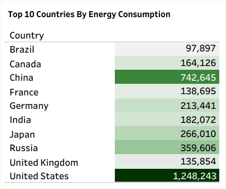
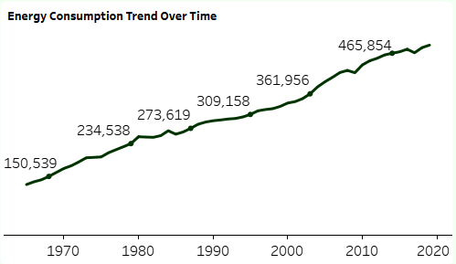

# World Energy Consumption Analysis

 

## Table of Contents
- [Project Overview](#project-overview)
- [About The Dataset](#about-the-dataset)
- [Tools Used](#tools-used)
- [Visualization in Tableau](#visualization-in-tableau)
- [Project Analysis](#project-analysis)
- [Tableau Dashboard Visualization](#tableau-dashboard-visualization)  
- [Recommendations on Strategies for Improving Energy Efficiency, Increasing Renewable Energy Adoption, and Reducing Carbon Emissions](#recommendations-on-strategies-for-improving-energy-efficiency-increasing-renewable-energy-adoption-and-reducing-carbon-emissions)
 

## Project Overview
### Introduction:
The "World Energy Consumption Analysis" project aims to provide a comprehensive analysis of global energy consumption patterns using the dataset provided by Our World in Data. This dataset, regularly updated, offers key metrics on energy consumption, energy mix, electricity mix, and other relevant factors, making it an invaluable resource for understanding the current state and trends in global energy use.

## Objectives:
The goal of the World Energy Consumption Analysis project are:
- Identify the top 10 countries by total energy consumption.
- Determine the top 10 countries by electricity generation.
- Identify the top 10 countries by energy consumption per GDP.
- Identify the top 10 countries by energy consumption per capita.
- Evaluate trends in energy consumption by year.
- Assess trends in carbon intensity by year.
- Identify the top 10 countries by Nuclear consumption.
- Identify the top 10 countries by Low Carbon consumption.
- Identify the top 10 countries by Hydro consumption.
- Identify the top 10 countries by renewable energy consumption.
- Identify the top 10 countries by gas consumption.

  ### Expectations:
- Learn the global distribution of energy consumption.
- Know the top countries in electricity generation.
- Compare the energy efficiency by looking at the energy consumption against GDP.
- Observe energy consumption patterns by capita.
- Take a view of the historical trends of world energy consumption.
- Follow changes in carbon intensity of electricity generation
- Know the top leaders in using renewable energy.
- Look at gas consumption trends in the top countries.
- Understand the position of nuclear energy in top countries.
- Identify top countries on the basis of low-carbon energy adoption.
- Assess the standing of hydro energy among top countries.
 

### About The Dataset
This dataset is a collection of key metrics maintained by [Our World in Data](https://ourworldindata.org/energy). It is updated regularly and includes 
data on energy consumption (primary energy, per capita, and growth rates), energy mix, electricity mix, and 
other relevant metrics. The dataset is made up of a table with 130 fields. The Energy consumption (primary energy, energy mix and energy intensity) fields data is sourced from a combination of two sources — the [BP Statistical Review of World Energy](https://www.bp.com/en/global/corporate/energy-economics.html) and [SHIFT Data Portal](https://www.theshiftdataportal.org/energy). The Electricity consumption (electricity consumption, and electricity mix) fields are sourced from a combination of two sources: the [BP Statistical Review of World Energy](https://www.bp.com/en/global/corporate/energy-economics.html) and [EMBER – Global Electricity](https://ember.shinyapps.io/GlobalElectricityDashboard/).

The other variables are collected from a variety of sources (United Nations, World Bank, Gapminder, Maddison Project Database, etc.). More information on the fields in ths data is available in [our codebook](https://github.com/owid/energy-data/blob/master/owid-energy-codebook.csv). The dataset for this analysis can be accessd [here](World%20Energy%20Consumption.csv). The variables in this data represent all of our main data related to energy consumption, energy mix, electricity mix as well as other variables of potential interest.

All the data is provided by Our World in Data are completely open access under the [Creative Commons BY license](https://creativecommons.org/licenses/by/4.0/). There are permissions for the usage of this data.
 
 

### Skills Utilized
1. Data Cleaning
2. Data Modelling
3. Data Visualiziation
4. Descriptive Analytics
5. Critical Thinking and Problem Solving
6. Communication and Reporting
 

### Tools Used
1. MS SQL Server
    - Was used to:
        1. Extract,
        2. Clean,
        3. Transform,
        4. Load all the datasets for this analysis.

2. Tableau (Was used to create dashboards for this analysis)
    - The following Tableau tools were incorporated:
        1. Calculated Fields
        2. Page Navigation
        3. Filters
        4. Tooltips
        5. Buttons
 

### Data Cleaning, Transformation and Loading using MS SQL Server:
Some data cleaning were done here, the data came almost clean as at when it was accessed from the source, i just had some cleaning to do here after which i importing the data into Tableau. I did the below:
1. Changed the data types of the fields that are of the wrong data types.
2. Made sure that all the data types of the 130 fields in this dataset were of the right data type.
 

**SQL View**

Sql Query Screenshot                                                               |                                
:---------------------------------------------------------------------------------:|
    

You can preview the SQL query file [here](World_Energy_Consumption_Analysis_Project.sql)
 
 

## Visualization in Tableau:
#### Report View 1

#### Report View 2

 
 

### Project Analysis:
From the analysis, i made the following Key findings below:
- Carbon Intensity (Total): __231,714__
- Energy Consumption (Total): __16,946,543__
- Energy Efficiency (Total): __12,684__
- Fossil Fuel Consumption (Total): __11,727,842__
- Hydro Consumption (Total): __840,003__
- Nuclear Consumption (Total): __687,171__
- Renewable Energy Consumption (Total): __1,026,638__
- Renewable Energy Share (%): __7__
 
 

- 

- **Top 10 Countries With Most Electricity Generation:**
- This top 10 countries' ranking analysis in electricity generation indicates that the United States and China are at the apex with 134,268 TWh and 100,948 TWh, respectively. Japan and Russia follow each, with a generation of approximately 34,000 TWh. India's is 23,869 TWh, while that of Germany rests at 21,046 TWh. Canada's is 20,764 TWh, while that of France is 18,488 TWh, Brazil at 13,920 TWh, and the UK is 12,528 TWh. The data thus reflects mostly countries with big economies, with a strong move to renewable energy.

- The top two are the United States and China due to the huge industrial base, followed by Japan and Russia. Both these countries are richly endowed with high technologies and rich natural resources. The demand from India, to meet fast-growing energy needs, and Germany's quest for renewable energy, reflects each country's priority for sustainable energy. Canada in hydropower, France in nuclear power, the UK recently did an energy shift toward a diverse mix with natural gas, nuclear, and renewable energy, and Brazil performs at the top in hydropower. These data point toward a diverse list of role models in terms of energy production among the major economies, underlining the trend toward renewable and low-carbon sources of energy.
 
 

- 

- **Top 10 Countries With Most Energy Consumption:**
- The top 10 countries by energy consumption are vastly different in their energy usage due to their economic activities and industrial bases. The US leads with 1,248,243 GWh, China is second with 742,645 GWh, Russia with 359,606 GWh, and Japan with 266,010 GWh. Germany with 213,441 GWh, India with 102,072 GWh, Canada with 164,126 GWh, France with 138,695 GWh, the UK with 135,854 GWh, and Brazil with 97,897 GWh.

- The US and China are the biggest energy consumers because they are the economic leaders. Industrialized countries like Russia, Japan, and Germany have high consumption because of their advanced industrial activities. Emerging economies like India are seeing rapid energy demand growth. France and Brazil have strong nuclear and hydropower respectively, so they have good sustainable energy practices. The UK’s energy consumption shows a move towards a diverse and sustainable energy mix and reducing fossil fuel dependence. This highlights the global variation in energy consumption patterns driven by economic activities, energy policies, and development levels.
 
 

- 

- **Top 10 Countries With Most Renewable Energy Consumption:**
- This analysis shows that the United States leads with 60,752 GWh, China with 53,736 GWh, Canada 45,384 GWh, Brazil 38,914 GWh. Russia 15,961 GWh, Norway 15,667 GWh, Japan 14,974 GWh, India 13,137 GWh, France 10,700 GWh. Sweden makes it to the top 10 with 10,460 GWh.

- The top 2 renewable energy consumers US and China are leading the way to a sustainable future. Canada and Brazil are high consumers because of their large hydropower capacity. Russia and Norway are investing in hydropower, Japan and India are increasing their renewable adoption with industrial growth. France is in the list despite being a big nuclear player, they also invest in renewables and Sweden is known for its strong focus on sustainable energy sources, they also commit to renewable energy. These numbers show the trend towards renewable energy adoption driven by both resource availability and policy to reduce carbon footprint.
 
 

- 

- **Energy Consumption Trend by Year:**
- The "Energy Consumption by Year" line chart shows primary energy consumption from 2000 to 2019. This chart goes up. Starting at 338,362 GWh in 2000, it goes up. Big jumps in the early 2000s, 361,956 GWh in 2003 to 379,661 GWh in 2004. A small dip in 2009 probably due to the global financial crisis but overall it goes up. After 2010 it goes up some more, crossing 450,000 GWh in 2012 and almost 470,000 GWh in 2015.

- The up trend means global demand driven by population growth, industrialization and economic development. The dip in 2009 means global economic fluctuations affect energy use. The up trend after 2010 means strength and recovery in global energy demand probably driven by technology and increased energy access. This trend means we need to have sustainable energy policies to manage growing consumption and mitigate environmental impacts.
 
 

- 

- **Carbon Intensity Trend by Year:**
- The “Carbon Intensity Trend by Year” from 2000 to 2020 shows a big drop in carbon intensity over the two decades. From 12,795 in 2000, it fluctuates around 13,000 until 2004 then starts to decline more rapidly. By 2009 it’s down to 11,438 and continues to fall each year. Notable drops occur after 2012 with carbon intensity dropping from 11,281 to 10,112 by 2014. Then it accelerates after 2015 with a big drop from 9,945 in 2015 to 7,118 in 2020.

- The steady decline is due to global efforts to reduce carbon emissions through energy efficiency, cleaner energy, and stricter environmental regulations. The big drop after 2012 is due to international climate agreements and the adoption of renewable energy technologies. This shows progress in de-carbonizing energy but also means there is a need to keep going and accelerate the reduction in carbon intensity to tackle climate change.
 
 

- 

- **Top 10 Countries With Most Nuclear Consumption:**
- The numbers show the US is way ahead with 77,709 GWh, more than double France which is second with 38,524 GWh. Japan is third with 21,509 GWh, Germany 14,869 GWh and Russia 13,582 GWh. South Korea is next with 9,926 GWh and Canada 9,278 GWh. The UK is 8,907 GWh, Ukraine 7,331 GWh and Sweden 7,097 GWh. Each of these countries has a significant chunk of their energy mix.

- The US dominance in nuclear consumption means they have a big nuclear infrastructure and rely on nuclear power for electricity. France’s high nuclear consumption is because of their strategy to reduce carbon emissions. Japan’s high consumption despite reduction means they still rely on nuclear power. Germany’s position despite plans to phase out nuclear power means they are still in the energy mix. South Korea, Canada, UK, Ukraine and Sweden being in the top 10 means they have advanced nuclear programs and nuclear energy is important for diversifying energy sources and reducing carbon footprint. These numbers show the world relies on nuclear power for stable low carbon energy despite different national energy policies.
 
 

- 

- **Top 10 Countries With Most Low Carbon Consumption:**
- US is at the top of the list of top 10 countries with lowest carbon consumption with 138,461 GWh, China is second with 59,700 GWh, Canada (54,662 GWh) and France (49,224 GWh), respectively. Brazil is next with 39,720 GWh, Japan with 36,484 GWh, Russia with 29,543 GWh and Germany with 23,443 GWh. Sweden with 17,557 GWh and Norway with 15,667 GWh completes the list.

- US is at the top for low-carbon consumption because of its huge investment in low-carbon energy. China is at the second spot because of its strategic expansion in renewable energy to meet growing energy demands sustainably. Canada and Brazil’s dependence on hydropower and France’s focus on nuclear energy reduces their carbon footprint. Japan is investing in low-carbon technologies despite nuclear challenges, Russia and Germany are transitioning and have strategies to move to cleaner energy. Sweden and Norway are the benchmarks for their strong commitment to renewable energy, they are models for sustainable energy consumption.
 
 

- 

- **Top 10 Countries With Most Hydro Consumption:**
- China is at the top with 44,857 GWh, Canada is second with 43,751 GWh, the US is third with 41,137 GWh. Brazil 32,863 GWh, Russia 15,926 GWh, Norway 15,569 GWh, Japan 12,096 GWh, India 10,886 GWh, Sweden 9,377 GWh and France 9,111 GWh.

- China is leading in hydro consumption due to its massive renewable energy projects. Canada is high because of its abundant water resources. US is third because of its balanced approach to energy sources including hydropower. Russia, Norway, Japan and India’s high hydro consumption is because of their investments in hydro energy and also to diversify energy sources and reduce carbon emissions. Sweden and France are in the top ten because of their ongoing investments and commitment to renewable energy.
 
 

- 

- **Top 10 Countries With Most Gas Consumption:**
- In the “Top 10 Countries by Gas Consumption” list, the US is number one with 320,178 GWh. Russia is second with 140,260 GWh, Canada with 37,978 GWh and Germany with 34,996 GWh. The UK is next with 33,779 GWh and Iran follows with 32,428 GWh. Japan is next with 30,791 GWh and China is close behind with 29,008 GWh. Italy is 8th with 25,351 GWh and Ukraine 9th with 24,191 GWh.

- The US is number one in gas consumption because it uses natural gas for electricity generation, heating and industrial processes. Russia is second because it uses its own gas reserves. Canada and Germany’s high consumption is because they need gas for energy security and industrial purposes. The UK and Iran’s consumption is because gas is their primary energy source. Japan and China’s consumption is because they are shifting to gas to reduce coal and carbon. Italy and Ukraine are in the top 10 because of their energy consumption trends and gas is part of their energy strategy.
 
 

- 

- **Top 10 Countries With Most Energy Per GDP:**
- The Top 10 Countries by Energy Per GDP chart is led by Trinidad and Tobago with 299.3 units per GDP. Bahrain and Singapore follow with 265.3 and 261.1 units per GDP respectively. These are the amount of energy consumed per economic output of the country. Mongolia and North Korea with 220.9 and 207.3 units per GDP also make it to this list as they consume a lot of energy relative to their GDP.

- Trinidad and Tobago and Bahrain have high energy per GDP so their economies are energy dependent often due to energy intensive industries like oil and gas. This means they consume a lot of energy to produce economic output and may be inefficient or heavily dependent on energy resources.
 
 

- 

- **Top 10 Countries With Most Energy Per Capita:**
- Here’s the breakdown: Gibraltar top with 30,540,961 units, way ahead of second place Qatar with 10,480,614. Then the USVI and UAE with 8,604,615 and 6,891,825 respectively. Canada, Kuwait, Bahrain and Luxembourg also made the top 10 with 5,726,904, 5,641,934, 5,554,267 and 5,511,387 units respectively. Iceland and Norway were also in the top 10 with 5,283,391 units each.

- The very high per capita energy consumption of Gibraltar could mean an intensive energy use relative to its population size, which again may be the result of a combination of intensive industrial activity and lower population. The ranking of Qatar and the United Arab Emirates comes as no surprise, given their excess production capacity for oil and huge gas reserves whose intensive energy uses are musts in these major producing and exporting countries. The presence of developed countries like Canada, Luxembourg, and Norway suggests that high living standards and industrials are massive contributors to their energy consumption.
 
 

## Tableau Dashboard Visualization:
You can view and interact with this dashboard report [here](https://public.tableau.com/app/profile/ugo.bruno/viz/WORLDENERGYCONSUMPTIONANALYSIS_17037361849100/Dashboard1)
 
 
 

## Recommendations on Strategies for Improving Energy Efficiency, Increasing Renewable Energy Adoption, and Reducing Carbon Emissions
- Smart grids and advanced metering infrastructure should be used to optimize electricity distribution, minimize losses, and embrace renewable energy sources integration more.
- Financial incentives and adoption of effective renewable energy projects, such as solar, wind, and hydroelectric power, will be the ways to diversify the energy mix.
- Besides identifying energy losses through an energy audit, companies can work on retrofitting buildings, industrial equipment, and transportation systems to improve energy efficiency.
- Getting the public aware of energy conservation being a key factor in climate change worldwide and also getting practical tips for reducing energy use in their homes and workplaces through the proper use of energy.
- Besides the strict energy efficiency standards and regulations for energy-efficient appliances, vehicles, and industrial equipment, one of the measures that could be taken is the enforcement of energy waste and carbon emission reductions at the appliance, vehicle, and industrial equipment levels.
- Introduce the carbon tax and/or cap-and-trade as the carbon pricing method that can motivate companies to decrease their total emissions in various sectors.
- Apart from backup power systems and smart grid technologies, such as those used in the electricity sector, investment in resilient energy infrastructure including solutions like grid modernization will bring in more energy security and reliability in the case of natural disasters and grid collapse.
- Strengthen the resources through international cooperation and knowledge transfer while agreeing on global standards in energy conservation, storage, and generating clean energy.
 
 

## Thank You For Following Through!

