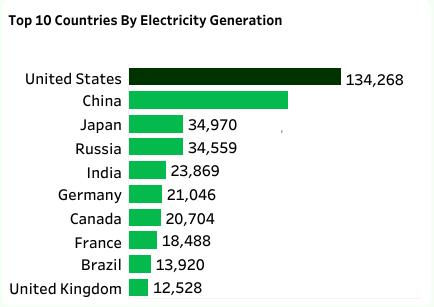

# World Energy Consumption Analysis

## Project Overview
### Introduction:
The "World Energy Consumption Analysis" project aims to provide a comprehensive analysis of global energy consumption patterns using the dataset provided by Our World in Data. This dataset, regularly updated, offers key metrics on energy consumption, energy mix, electricity mix, and other relevant factors, making it an invaluable resource for understanding the current state and trends in global energy use.

## Objectives:
The primary objectives of the World Energy Consumption Analysis project are:
- Identify the top 10 countries by total energy consumption.
- Determine the top 10 countries by electricity generation.
- Identify the top 10 countries by GDP and population.
- Identify the top 10 countries by energy consumption per GDP.
- Identify the top 10 countries by energy consumption per capita.
- Evaluate trends in energy consumption by year.
- Assess trends in carbon intensity by year.
- Identify the top 10 countries by renewable energy consumption.
- Identify the top 10 countries by solar energy consumption.
- Identify the top 10 countries by wind energy consumption.
- Identify the top 10 countries by biofuel consumption.
- Identify the top 10 countries by gas consumption.
- Identify the top 10 countries by fossil fuel consumption.
- Identify the top 10 countries by coal consumption.

  ### Expectations:
- Gain insights into the global distribution of energy consumption.
- Understand the leading countries in electricity generation.
- Correlate energy consumption with economic and population data.
- Evaluate energy efficiency by comparing energy consumption per GDP.
- Analyze energy consumption patterns on a per capita basis.
- Observe historical trends in global energy consumption.
- Track changes in the carbon intensity of electricity generation.
- Identify leaders in renewable energy adoption.
- Understand the contributions of solar energy by top countries.
- Analyze wind energy consumption among leading countries.
- Evaluate the use of biofuels in top-consuming countries.
- Assess gas consumption patterns across top countries.
- Examine the global distribution of fossil fuel consumption.
- Identify major coal-consuming countries.
- Understand the role of nuclear energy in top countries.
- Highlight countries leading in low-carbon energy adoption.
- Assess the importance of hydro energy among top countries.

### About The Dataset
This dataset is a collection of key metrics maintained by [Our World in Data](https://ourworldindata.org/energy). It is updated regularly and includes 
data on energy consumption (primary energy, per capita, and growth rates), energy mix, electricity mix, and 
other relevant metrics. The dataset is made up of a table with 130 fields. The Energy consumption (primary energy, energy mix and energy intensity) fields data is sourced from a combination of two sources—the [BP Statistical Review of World Energy](https://www.bp.com/en/global/corporate/energy-economics.html) and [SHIFT Data Portal](https://www.theshiftdataportal.org/energy). The Electricity consumption (electricity consumption, and electricity mix) fields are sourced from a combination of two sources: the [BP Statistical Review of World Energy](https://www.bp.com/en/global/corporate/energy-economics.html) and [EMBER – Global Electricity](https://ember.shinyapps.io/GlobalElectricityDashboard/).

The other variables are collected from a variety of sources (United Nations, World Bank, 
Gapminder, Maddison Project Database, etc.). More information on the fields in ths data is available in [our codebook](https://github.com/owid/energy-data/blob/master/owid-energy-codebook.csv). The dataset for this analysis can be accessd [here](World%20Energy%20Consumption.csv). The variables in this data represent all of our main data related to energy consumption, energy mix, electricity mix as well as other variables of potential interest.

All visualizations, data, and code produced by Our World in Data are completely open access under the [Creative Commons BY license](https://creativecommons.org/licenses/by/4.0/). You have the permission to use, distribute, and reproduce these in any medium, provided the source and authors are credited.

### Skills Utilized
1. Data Cleaning
2. Data Modelling
3. Data Visualiziation
4. Descriptive Analytics
5. Critical Thinking and Problem Solving
6. Communication and Reporting

### Tools Used
1. MS SQL Server
    - Was used to:
        1. Extract,
        2. Clean,
        3. Transform,
        4. Load all the datasets for this analysis.

2. Tableau (Was used to create dashboards for this analysis)
    - The following Tableau were incorporated:
        1. Calculated Fields
        2. Geospatial Analysis
        3. Page Navigation
        4. Filters
        5. Tooltips
        6. Buttons
     

### Data Cleaning, Transformation and Loading using MS SQL Server:
A little data cleaning was done here because the data was almost clean as at when it was accessed from the source, i just had little work to do here before importing the data source into Tableau. I did the below:
1. Changed the data type of thise fields that are of the wrong data type to the right data type.
2. Made sure that all the data types of the 130 fields in this dataset were of the right data type.

**MS SQL Server View**

Sql Query Screenshot                                                               |                                
:---------------------------------------------------------------------------------:|
    

You can preview the MYSQL query file [here](World_Energy_Consumption_Analysis_Project.sql)

## Visualization in Tableau:
#### Report View 1

#### Report View 2

### Project Analysis:
From the analysis, i made the following Key findings below:
- Carbon Iintensity (Total): __231,714__
- Energy Consumption (Total): __16,946,543__
- Energy Efficiency (Total): __12,684__
- Fossil Fuel Consumption (Total): __11,727,842__
- Hydro Consumption (Total): __840,003__
- Nuclear Consumption (Total): __687,171__
- Renewable Energy Consumption (Total): __1,026,638__
- Renewable Energy Share %: __7__
-

- 
- **Top 10 Countries by Electricity Generation:**
- In this analysis of the top 10 countries by electricity generation, it shows that the United States and China lead with 134,268 TWh and 100,948 TWh, respectively. Japan and Russia follow, each generating around 34,000 TWh. India’s generates 23,869 TWh, while Germany’s generates 21,046 TWh. Canada 20,764 TWh, and France 18,488 TWh, Brazil 13,920 TWh, and the UK generates 12,528 TWh. This data stresses the strength and dominance of major economies and a shift towards sustainable energy.

- This analysis also reveals that the United States and China dominate due to their vast industrial bases. Japan and Russia follow closely, driven by advanced technology and abundant natural resources. India’s growing energy demand reflects its rapid economic expansion, while Germany’s focus on renewables highlights its commitment to sustainable energy. Canada leverages hydropower, France relies on nuclear energy, Brazil excels in hydropower, and the UK is transitioning to a diverse energy mix of of natural gas, nuclear, and renewables. This data highlights the energy production leadership of major economies and a global shift towards renewable and low-carbon energy sources.

- 
- **Top 10 Countries by GDP and Population:**
- In this analysis
